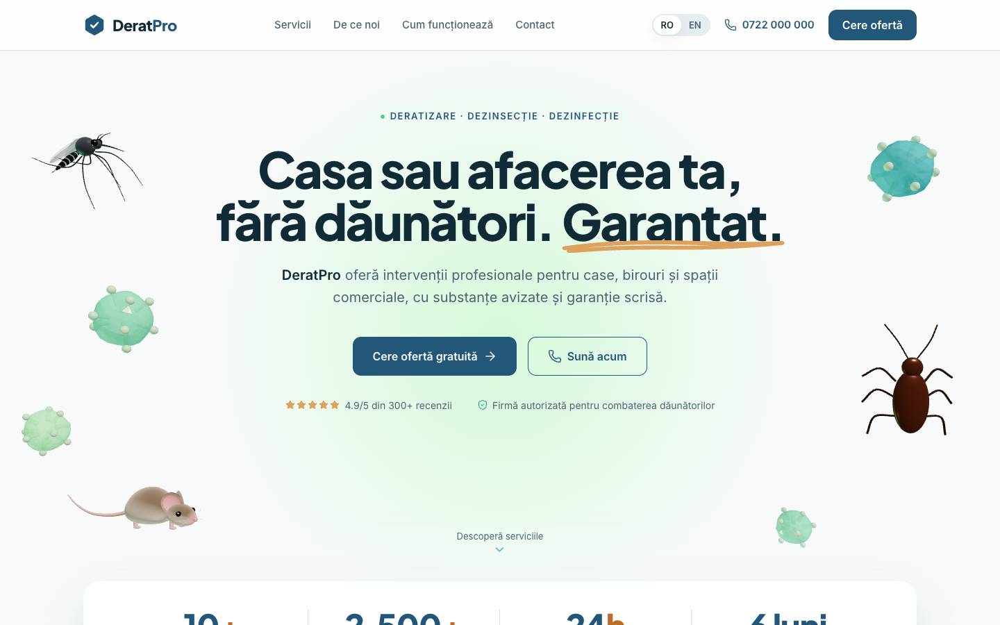
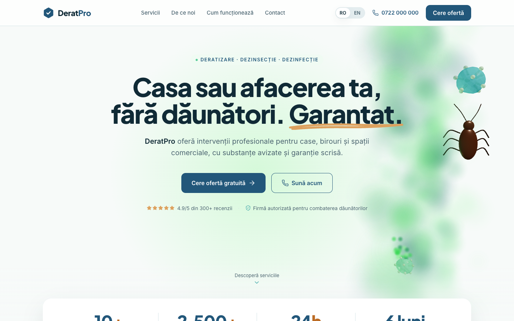
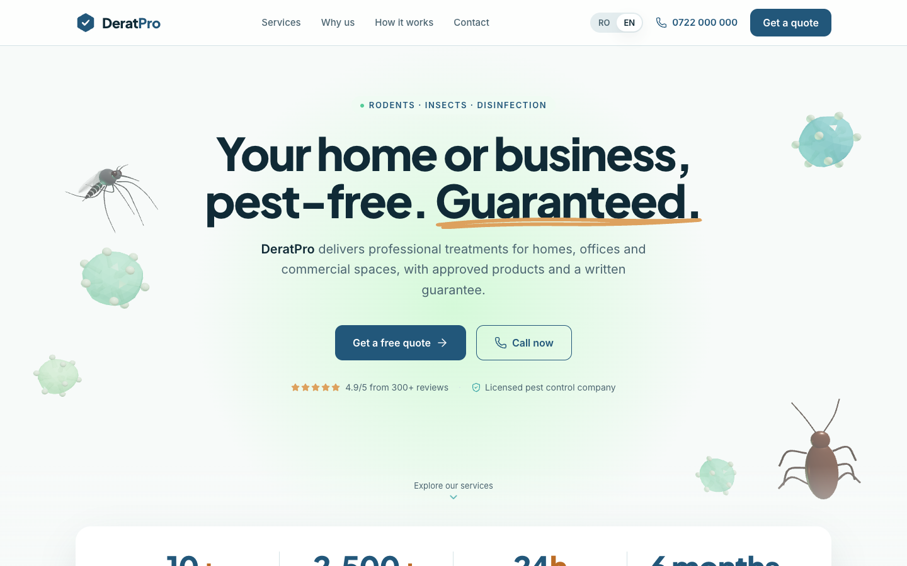
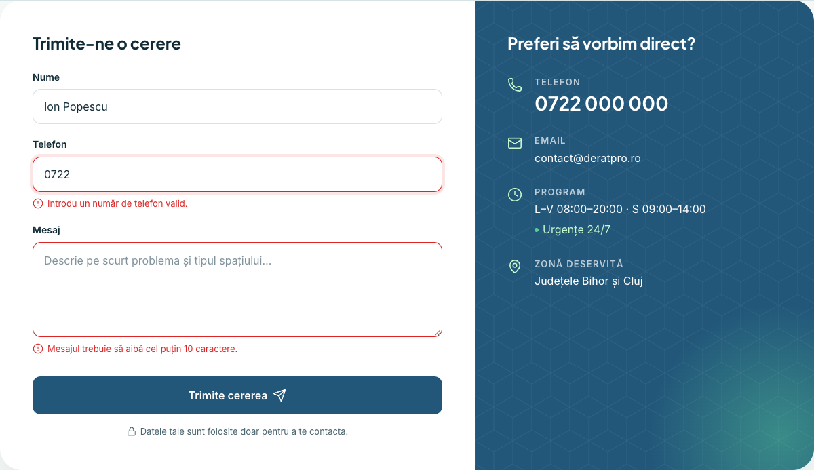
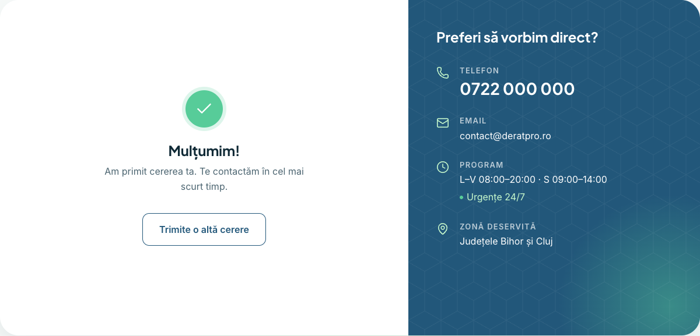
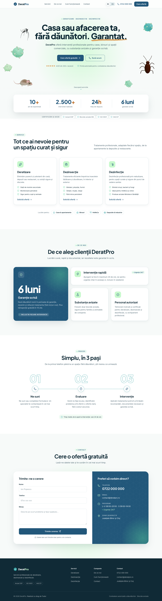
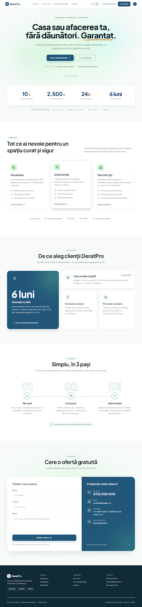

# DeratPro Landing Page

## 🔗 Live Demo

[deratpro-landing.netlify.app](https://deratpro-landing.netlify.app/ro/)

A modern, responsive landing page for **DeratPro**, a fictional Romanian pest-control company offering rodent control, insect control and disinfection for homes and businesses. The page is built to earn trust and turn visitors into quote requests.

The hero runs an interactive Three.js scene, **"Clean Sweep"**: a mouse, a cockroach, a mosquito and microbes (one per service) wander the edges until a spray mist sweeps through and dissolves them into mint sparkles. Your cursor is the spray nozzle.

The site is available in Romanian and English. The UI concept started in **Google Stitch** and was rebuilt as a production Next.js site.

## Table of Contents

- [Preview](#preview)
- [Technologies Used](#technologies-used)
- [Features](#features)
  - [Interactive 3D Hero](#interactive-3d-hero)
  - [Bilingual Interface](#bilingual-interface)
  - [Quote Form with Validation](#quote-form-with-validation)
  - [Responsive and Accessible](#responsive-and-accessible)
- [Page Sections](#page-sections)
- [Design Tool and Prompt](#design-tool-and-prompt)
  - [Google Stitch](#google-stitch)
  - [Prompt: the Design Documents](#prompt-the-design-documents)
  - [From Stitch Output to Production](#from-stitch-output-to-production)
- [Hero Animation: Clean Sweep](#hero-animation-clean-sweep)
- [Internationalization](#internationalization)
- [Project Structure](#project-structure)
- [Development](#development)
- [Deployment](#deployment)
- [Decisions and Trade-offs](#decisions-and-trade-offs)
- [Git Workflow](#git-workflow)
- [Project Purpose](#project-purpose)
- [License](#license)
- [Additional Resources](#additional-resources)

## Preview

### Hero (desktop)



### Spray mist sweeping the scene



### Mobile and English

| Mobile (390px)                                      | English version                                          |
| --------------------------------------------------- | -------------------------------------------------------- |
|  |  |

### Contact form states

| Validation errors                                       | Confirmation                                          |
| ------------------------------------------------------- | ----------------------------------------------------- |
|  |  |

### Full page (desktop)



## Technologies Used

- [Next.js](https://nextjs.org) 16 - React framework, App Router with static export.
- [React](https://react.dev) 19 - UI components.
- [TypeScript](https://www.typescriptlang.org) 5 - implementation language, strict mode.
- [Tailwind CSS](https://tailwindcss.com) 4 - styling, with the design tokens defined in `@theme`.
- [three.js](https://threejs.org) r186 - 3D rendering for the hero scene.
- [React Three Fiber](https://r3f.docs.pmnd.rs) 9 - React renderer for three.js.
- [Lucide](https://lucide.dev) - line icons (`lucide-react`).
- [clsx](https://github.com/lukeed/clsx) and [tailwind-merge](https://github.com/dcastil/tailwind-merge) - conditional class names without Tailwind conflicts.
- [Inter](https://fonts.google.com/specimen/Inter) and [Plus Jakarta Sans](https://fonts.google.com/specimen/Plus+Jakarta+Sans) - body and heading fonts, self-hosted via `next/font`.
- [Vitest](https://vitest.dev) and [Testing Library](https://testing-library.com) - unit and component tests.
- [Playwright](https://playwright.dev) - end-to-end tests on desktop and mobile viewports.
- [axe-core](https://github.com/dequelabs/axe-core) - automated accessibility checks.
- [ESLint](https://eslint.org) - linting with the Next.js rules.
- [Prettier](https://prettier.io) and [prettier-plugin-tailwindcss](https://github.com/tailwindlabs/prettier-plugin-tailwindcss) - formatting and Tailwind class sorting.
- [husky](https://typicode.github.io/husky/) and [lint-staged](https://github.com/lint-staged/lint-staged) - pre-commit hook that formats staged files.
- [Netlify](https://www.netlify.com) - free static hosting.

## Features

### Interactive 3D Hero

The hero background is a 12-second animated loop that tells the company's story: pests appear, a spray mist sweeps through, and the space is left clean.

- one creature for each service: a mouse, a cockroach and mosquito, and microbes
- the cursor works as a spray nozzle, and a tap sprays a burst on touch screens
- creatures always keep clear of the text, on any screen size

How it works in detail: [Hero Animation: Clean Sweep](#hero-animation-clean-sweep).

### Bilingual Interface

The site supports two languages:

- Romanian (default)
- English

Each language has its own URL, and the RO/EN switch in the header keeps your place on the page.

### Quote Form with Validation

The contact form checks:

- name: at least 2 characters
- phone: a Romanian number (`07…`, `02…`, `03…`, with or without `+40`)
- message: at least 10 characters

Errors appear after the first submit and clear as soon as a field is fixed. A valid request shows a confirmation message. No data is sent anywhere.

### Responsive and Accessible

- layouts for phone, tablet and desktop, checked from 330px to 1440px
- keyboard navigation, visible focus, labelled sections and WCAG AA contrast
- automated accessibility checks in both languages
- the 3D scene is skipped for visitors who prefer reduced motion or whose browser lacks WebGL

## Page Sections

The page has five main sections, one under the other.

### Hero

- company name, headline and subline
- primary CTA "Cere ofertă gratuită" and a "Sună acum" call button
- rating and license trust line

### Services

- rodent control, insect control and disinfection
- each with an icon, title, short description and three key points
- the audiences served: homes, offices, hospitality, warehouses

### Why DeratPro

- 6-month written guarantee
- fast response, within 24 hours
- approved products
- licensed technicians

### How It Works

- 01 Ne suni (you call us)
- 02 Evaluare (assessment)
- 03 Intervenție (treatment)

### Contact

- quote form with name, phone and message
- direct contact panel: phone, email, opening hours, service area

Also on the page: a sticky header with navigation, a stats card under the hero, a footer, and a floating call button on phones.

## Design Tool and Prompt

### Google Stitch

The UI concept was generated with [Google Stitch](https://stitch.withgoogle.com). It produced four screens (desktop, mobile, form error, form success), their HTML exports, and the first prototype of the hero animation. Everything it produced is kept unchanged in [`docs/design-output/`](docs/design-output/).

| Stitch concept                                                   | Final site                                               |
| ---------------------------------------------------------------- | -------------------------------------------------------- |
|  |  |

### Prompt: the Design Documents

Instead of a single free-form prompt, Stitch was given a set of written design documents:

- [`docs/landing-page-spec.md`](docs/landing-page-spec.md) - page structure, the exact Romanian copy, and the four screens to produce.
- [`docs/DESIGN.md`](docs/DESIGN.md) - design system: colours, typography, spacing, components, do's and don'ts.
- [`docs/design-decisions.md`](docs/design-decisions.md) - the reasoning: research on Romanian pest-control websites and palette selection.
- [`docs/hero-animation.md`](docs/hero-animation.md) - the "Clean Sweep" animation concept and its timeline.

### From Stitch Output to Production

The Stitch output was the starting point, not the final code:

- static HTML became typed React components, one folder per section
- the generic colour names from the export were replaced by the `DESIGN.md` tokens, defined once in Tailwind
- Material Symbols were replaced by Lucide line icons
- copy that drifted from the spec was corrected, then translated into English
- the error and success screens became a real form with validation
- the single-file animation prototype was rebuilt in React Three Fiber
- every section got a mobile layout and accessibility support

## Hero Animation: Clean Sweep

The loop runs every 12 seconds:

| Time         | Phase                                                                                     |
| ------------ | ----------------------------------------------------------------------------------------- |
| 0 to 5.5s    | Pests enter and wander the edges; the centre stays calm behind the headline               |
| 5.5 to 8.8s  | A teal-mint mist sweeps left to right; every pest it touches dissolves into mint sparkles |
| 8.8 to 10.5s | "Clean moment": a soft light passes over the empty scene                                  |
| 10.5 to 12s  | Pests re-materialise and the loop restarts                                                |

What the production version adds over the Stitch prototype:

- **Creatures built in code**: a mouse with fur, whiskers and stepping legs, a cockroach, a mosquito with veined wings and a banded abdomen, and translucent microbes
- **Dissolve effect**: pests break up along a noise pattern with a glowing mint edge
- **Soft mist**: made of soft puffs and thinned out over the text so it stays readable
- **Layout around the text**: the scene measures where the hero text sits and places creatures around it
- **Performance**: loads after the page, pauses when off-screen or when the tab is hidden, frees GPU memory on exit

The code is split into pure, unit-tested logic (`hero/engine/`: timeline, pest life cycle, layout) and the 3D objects that use it (`hero/scene/`).

## Internationalization

All visible text lives in two typed files:

```
src/i18n/
 ├── config.ts          supported languages and DEFAULT_LOCALE
 └── dictionaries/
      ├── ro.ts         Romanian copy
      ├── en.ts         English copy, type-checked against ro.ts
      └── index.ts
```

- `/ro/` and `/en/` are both generated at build time, each with its own `lang`, title and description
- `/` redirects to the default language
- tests make sure both languages have the same keys and that Romanian uses correct diacritics (ș, ț)

## Project Structure

```
docs/
 ├── DESIGN.md                    design system
 ├── landing-page-spec.md         structure and copy
 ├── design-decisions.md          research and rationale
 ├── hero-animation.md            Clean Sweep concept
 ├── design-output/               raw Google Stitch output
 └── screenshots/                 README images
e2e/
 └── landing.spec.ts              Playwright + axe tests
src/
 ├── app/
 │   ├── (root)/                  "/" forwards to the default language
 │   ├── [lang]/                  layout and page for /ro and /en
 │   ├── globals.css              Tailwind theme (design tokens)
 │   └── icon.svg, favicon.ico, apple-icon.png
 ├── components/
 │   ├── layout/                  Header, LanguageSwitch, Footer, FloatingCall
 │   ├── sections/                one folder per page section
 │   │   ├── hero/
 │   │   │   ├── Hero.tsx
 │   │   │   ├── HeroBackground.tsx   decides whether and when to load the scene
 │   │   │   ├── HeroScene.tsx        the canvas
 │   │   │   ├── engine/              pure logic: timeline, layout, pest life cycle
 │   │   │   └── scene/               3D objects, shaders, particles
 │   │   ├── stats/
 │   │   ├── services/
 │   │   ├── why-us/
 │   │   ├── how-it-works/
 │   │   └── contact/                 Contact, ContactForm, Field, validation
 │   └── ui/                      shared building blocks, one component per file
 ├── hooks/                       shared React hooks
 ├── i18n/                        language config and copy
 ├── lib/                         class merging, fonts
 └── test/                        test setup
.husky/pre-commit                 formats staged files
netlify.toml                      build settings and the "/" redirect
```

Tests sit next to the code they cover (`*.test.ts` / `*.test.tsx`).

## Development

### Prerequisites

- [Node.js](https://nodejs.org) 24
- [pnpm](https://pnpm.io) 11 (`corepack enable` installs the version pinned in `package.json`)

### Install dependencies

```bash
pnpm install
```

### Development server

```bash
pnpm dev
```

Open [http://localhost:3000](http://localhost:3000). It forwards to `/ro/`; the English version is at `/en/`. The page reloads automatically when you change a source file.

### Building

```bash
pnpm build
```

This creates a fully static site in `out/`. To check the build locally:

```bash
pnpm preview
```

### Running unit tests

```bash
pnpm test
```

Vitest and Testing Library cover every section, the form and its validation, the language files, and the hero's timeline and layout logic.

### Running end-to-end tests

```bash
pnpm exec playwright install chromium   # first time only
pnpm build && pnpm test:e2e
```

Playwright runs against the static build on desktop (1440px) and mobile (390px): page rendering, the `/` redirect, language switching, the form, navigation, the 3D scene and its reduced-motion fallback, plus axe accessibility checks in both languages.

### Formatting and linting

```bash
pnpm format       # format the whole project with Prettier
pnpm lint         # ESLint
pnpm typecheck    # TypeScript
```

A pre-commit hook (husky + lint-staged) formats every staged file automatically, so each commit is already formatted.

## Deployment

The site is hosted for free on Netlify as a static site. [`netlify.toml`](netlify.toml) holds the build command (`pnpm build`), the publish folder (`out`), the Node version and the `/` redirect, so connecting the GitHub repository is the only manual step.

## Decisions and Trade-offs

- **No server.** The site is a static export: fast and free to host, with nothing to break at runtime. The cost is that the form cannot send anything; real delivery would need a form service or a serverless function.
- **Creatures built in code instead of 3D models.** No model files to download or license, and full control over the dissolve effect. The cost is realism: sculpted, rigged models would look more lifelike.
- **3D loaded after the page.** The headline and buttons appear first and the scene follows a moment later as a separate download (about 250 KB gzipped). Visitors who prefer reduced motion never download it.
- **Readability over spectacle.** Creatures and mist stay away from the text. On phones the text fills most of the hero, so the creatures only peek in from the edges.
- **Separate URLs per language.** Each language gets its own shareable link and metadata. The cost is a redirect when someone opens `/`.
- **A known warning filtered.** React Three Fiber 9 still uses a deprecated part of three.js internally. That one warning is filtered until React Three Fiber 10 is stable; all other warnings still show.

## Git Workflow

- [Conventional Commits](https://www.conventionalcommits.org) (`feat`, `fix`, `refactor`, `test`, `build`, `style`, `chore`), one logical change per commit
- work happens on `develop`; `main` holds released versions
- every commit is formatted by the pre-commit hook

## Project Purpose

This project was built as a front-end technical challenge: design and build a landing page for a client without a design brief, starting the UI from an AI design tool and finishing it as a clean, working site.

DeratPro is a fictional company. Its phone number, email, reviews and statistics are placeholders.

## License

[MIT](LICENSE) © 2026 Tudor555

## Additional Resources

- [Google Stitch](https://stitch.withgoogle.com) - the AI tool used for the UI concept.
- [Next.js documentation](https://nextjs.org/docs) - including [static exports](https://nextjs.org/docs/app/guides/static-exports) and [internationalization](https://nextjs.org/docs/app/guides/internationalization).
- [Tailwind CSS theme variables](https://tailwindcss.com/docs/theme) - how the design tokens are defined.
- [three.js documentation](https://threejs.org/docs/) and [React Three Fiber documentation](https://r3f.docs.pmnd.rs).
- [Lucide icon set](https://lucide.dev/icons/).
- [WCAG 2.1 quick reference](https://www.w3.org/WAI/WCAG21/quickref/) - the accessibility guidelines followed.
- [Netlify file-based configuration](https://docs.netlify.com/configure-builds/file-based-configuration/).
- Research on Romanian pest-control websites: [`docs/design-decisions.md`](docs/design-decisions.md#15-reference-sites-romanian-ddd-market).
